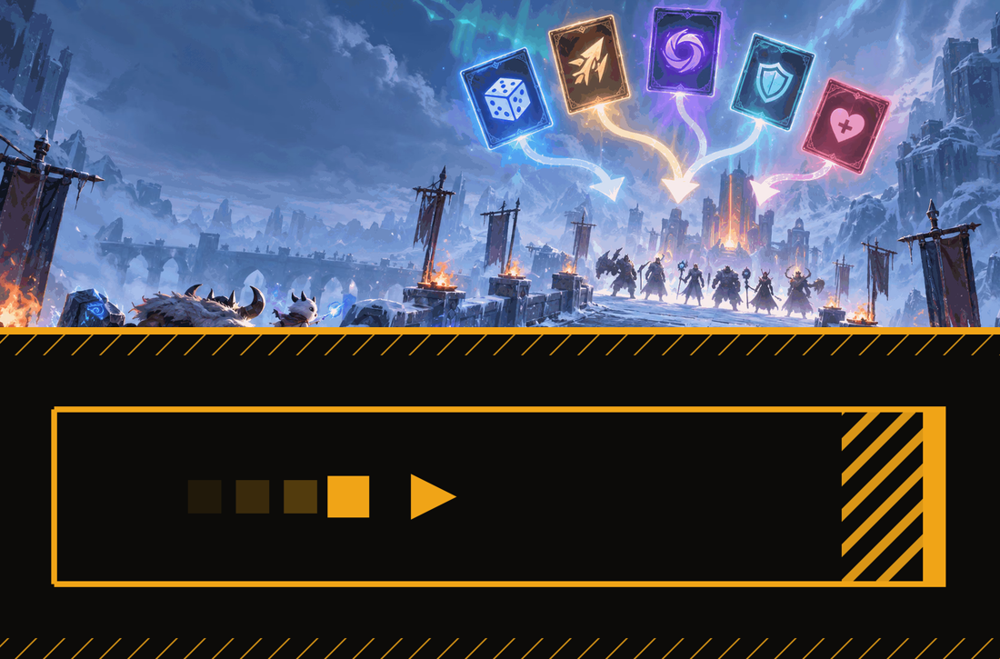
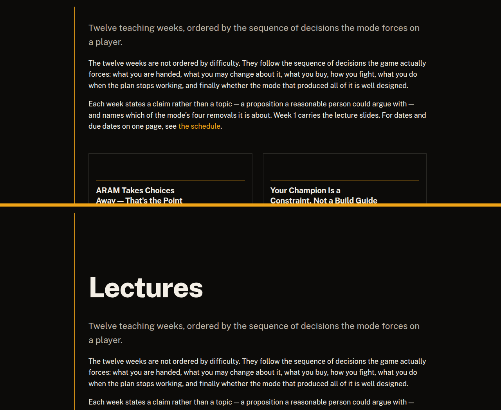
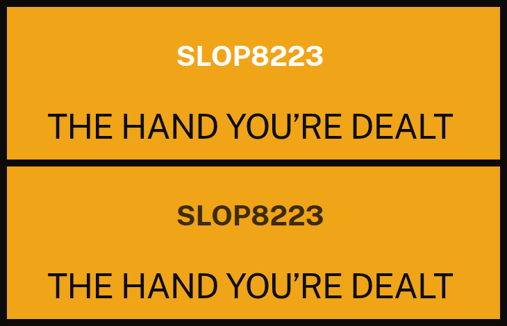

# Process overview

## What I built

**SLOP8223 — HEX ARAM: The Hand You're Dealt**, a twelve-week postgraduate
course on decision-making inside a game mode that takes the decisions away. The
course argues one thing: removing choice does not remove strategy, it relocates
it — from choosing your champion to working out what the one you were handed
can be made to do. The site is twelve teaching weeks, three pieces of
assessment, a lecture deck, a schedule, policies and a convener, held together
by four constraint slugs that every week must name.

## How I got here

The working method was three rules: give the agent hard constraints before
content so drift fails a check rather than a read-through; commit at the point
a decision is made, so the message carries the reason; and verify in a real
browser, because a green build says nothing about what a page looks like. Each
screenshot below was rebuilt from the commit named beside it, not kept from the
session that produced it — so anyone can reproduce them.

**The checks were written before the course they check.**
[`55f7427`](https://github.com/comp4020-agentic-coding-studio/comp4020-ass2-pangxuancong/commit/55f7427) added `spec/course-promises.test.ts` — twelve
ungapped weeks in date order, assessment summing to 100% and never due before
the weeks it cites, a unique claim per week — against a repo that was still all
placeholder. Writing the promises first meant the curriculum had to be argued
into existence, not retrofitted.

**The harness was written from what had already gone wrong.**
[`ae6b2e4`](https://github.com/comp4020-agentic-coding-studio/comp4020-ass2-pangxuancong/commit/ae6b2e4) replaced the empty `CLAUDE.md` with the course's
constitution. Two of its sections exist only because of mistakes: §7 records the
repo facts an agent keeps getting wrong (unquoted YAML colons, the strict course
schema, the content-layer cache surviving a delete), and §8 lists what the build
already checks so `spec/` never duplicates it.

**Weeks were written out of order, on purpose.** Weeks 1, 6, 9 and 12 came first
([`a88b9fd`](https://github.com/comp4020-agentic-coding-studio/comp4020-ass2-pangxuancong/commit/a88b9fd)) because they are the four most different
intellectual modes; the three most likely to collapse into each other followed
([`662c543`](https://github.com/comp4020-agentic-coding-studio/comp4020-ass2-pangxuancong/commit/662c543)), then the remainder
([`94ee7d9...62ff850`](https://github.com/comp4020-agentic-coding-studio/comp4020-ass2-pangxuancong/compare/94ee7d9...62ff850)). The rule the harness
sets is that a marker reads non-adjacent weeks, so the risk to manage was
twelve pages that argue the same thing.

**The enforcement was itself tested.**
[`df76043`](https://github.com/comp4020-agentic-coding-studio/comp4020-ass2-pangxuancong/commit/df76043) added the evidence checks — no statistic without
a source and a patch, no week titled by difficulty. Each was confirmed against
a deliberately broken copy first: a naked 58%, a week retitled *Advanced Augment
Synergies*, an assignment moved to 30%. A check that has never failed is not
yet evidence of anything.

**Design came last, and it cost the artwork.**
[`a251d94`](https://github.com/comp4020-agentic-coding-studio/comp4020-ass2-pangxuancong/commit/a251d94) built the black-and-amber system and threw out
the illustrated hero — glowing cards, purple gradients, close to an official
Riot page, and disagreeing with its own alt text. The replacement is drawn in
flat geometry by `scripts/make-artwork.ts` and says what the course says: a hand
already dealt, one corridor, no way back, a barrier at the end.

**Reading the built site found what no test could.** Four pages shipped with no
`<h1>` at all — the theme's MDX layout renders the lead but no heading, so the
description floated above nothing and the section rule landed on every card.

On the deck, emphasis took the theme's opposite ink — white on amber, roughly
2:1, fine as a hue pairing and unreadable as text.

Both, plus an inconsistent `<title>` and a role dropped through a starter enum
this repo had replaced, were fixed in [`4b26626`](https://github.com/comp4020-agentic-coding-studio/comp4020-ass2-pangxuancong/commit/4b26626). Every
check was green throughout.
